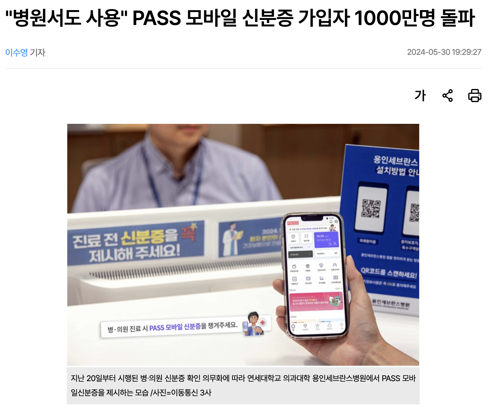
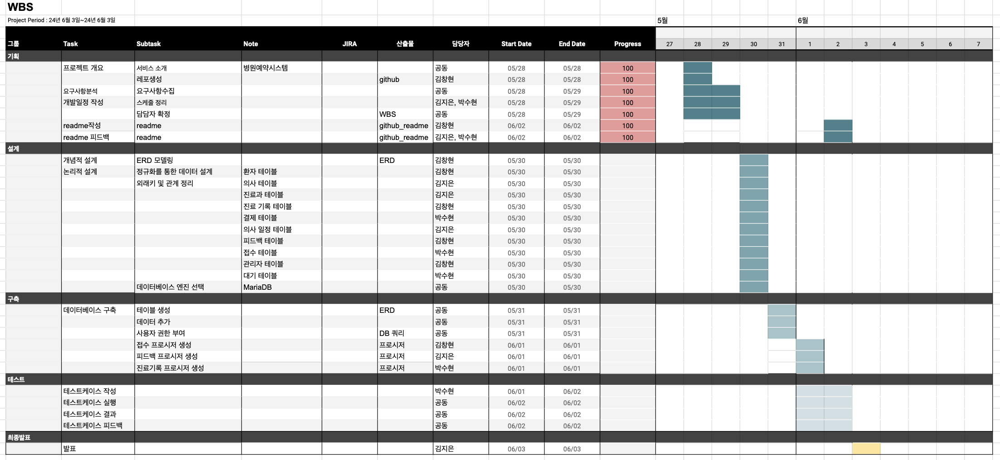
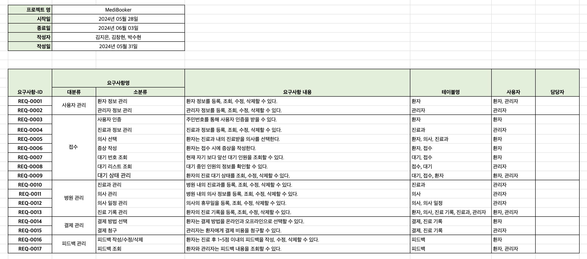
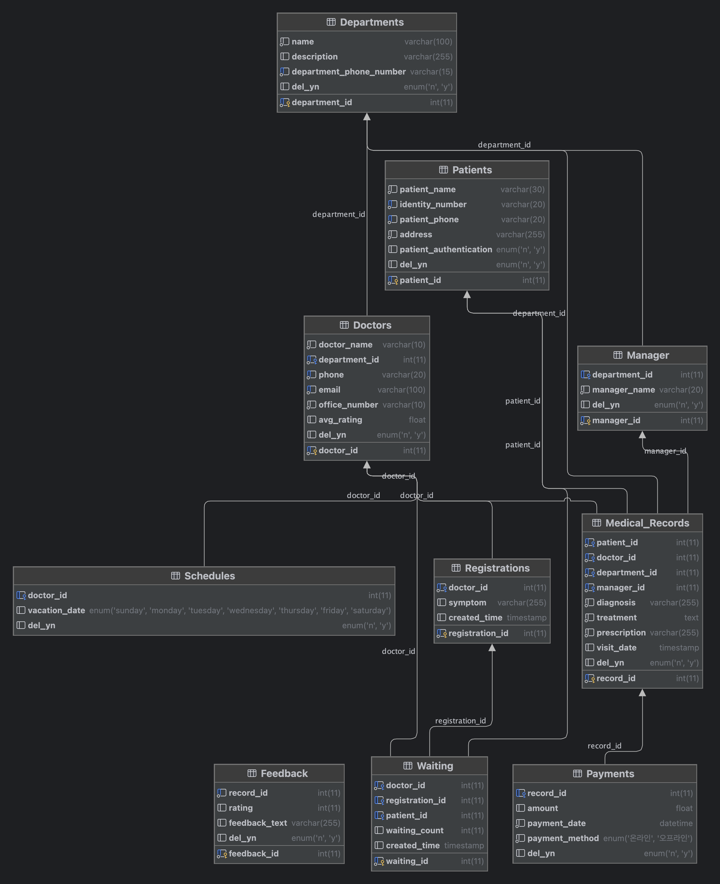

# 🏥MediBooker🏥


---

## 팀명: JJOB_DOC

### 팀원

|팀장|팀원|팀원|
|---|---|---|
||||
|김지은|김창현|박수현|

---

## 📢 프로젝트 소개
MediBooker는 환자와 병원 모두가 사용할 수 있는 혁신적인 의료 예약 서비스입니다. 이 프로젝트는 환자들이 간편하게 병원에 접수하고 자신의 대기 순번을 확인하며, 진료 내역과 처방 내역을 쉽게 확인할 수 있도록 개발되었습니다.

특히 짧은 시간 내에 병원을 이용해야 하는 직장인들은 원격 대기 기능을 통해 대기 시간을 줄이고, 복잡한 접수 과정을 생략할 수 있습니다. 더 나아가, 진료 내역서 또는 처방 내역서를 받기 위해 병원을 방문하거나 팩스를 이용하는 불편을 해소하고, 모바일 서비스를 통해 이를 간편하게 확인할 수 있어 편리함이 증대됩니다.

병원 측에서는 이 서비스를 통해 환자의 접수를 보다 효율적으로 관리하고, 진료 내역과 처방 내역을 제공할 수 있습니다. 원격 접수와 사용자 인증을 통해 복잡한 접수 절차와 환자 정보 입력 과정을 간소화할 수 있습니다.

---
## 💡 프로젝트 배경 및 필요성
<div style="display: flex; justify-content: space-between;">
    
    
</div>

최근 의료 서비스 관련 법이 개정되어 병원 방문 시 신분증 제시가 필수가 되었습니다. 이와 같은 의료 제도는 지갑을 들고 다니지 않고 삼성페이, 애플페이 등 페이 앱을 사용하는 사용자들에게 큰 불편함을 초래합니다. 물론 패스 앱 등을 통해 신분증 확인이 가능하지만, 병원에서 패스 앱을 통한 신분증 확인 및 본인 인증은 접수 시 혼잡을 가중시킬 수 있는 단점이 존재합니다.

또한, 병원에서 접수를 마친 후 자신의 순번을 확인하기 어려워 대기 시간을 파악하는 데 불편함이 있으며, 평일에 시간이 부족한 직장인들에게는 더욱 큰 불편을 야기합니다.

이러한 불편함을 해결하고자, 우리 JJOBDAK 팀은 원격 줄서기 서비스를 개발하기로 했습니다. 이 서비스를 통해 접수와 대기 시간에 대한 불편을 해소할 뿐만 아니라, 어플리케이션을 통해 진료 내역과 처방 내역을 확인하고 제공받을 수 있어 사용자들에게 큰 편리함을 제공할 수 있을 것입니다.

---
## 🗓️ 개발일정


## 📝 요구사항정의서


## 📋 ERD


## 🖌️ 주요 쿼리 요약
1. DDL
```sql
-- 환자 테이블 생성
CREATE TABLE Patients (
    patient_id INT PRIMARY KEY AUTO_INCREMENT,
    patient_name VARCHAR(30) NOT NULL,
    identity_number VARCHAR(20) NOT NULL UNIQUE,
    patient_phone VARCHAR(20) NOT NULL UNIQUE,
    address VARCHAR(255) NOT NULL,
    patient_authentication ENUM('N', 'Y') DEFAULT 'Y',
    del_yn ENUM('N', 'Y') DEFAULT 'N'
);
```


```sql
-- 진료기록 테이블
CREATE TABLE Medical_Records (
    record_id INT PRIMARY KEY AUTO_INCREMENT,
    patient_id INT NOT NULL,
    doctor_id INT NOT NULL,
    department_id INT NOT NULL,
    manager_id INT NOT NULL,
    diagnosis VARCHAR(255) NOT NULL,
    treatment TEXT NOT NULL,
    prescription VARCHAR(255) NOT NULL,
    visit_date TIMESTAMP DEFAULT CURRENT_TIMESTAMP,
    del_yn ENUM('N', 'Y') DEFAULT 'N',
    FOREIGN KEY (patient_id) REFERENCES Patients (patient_id),
    FOREIGN KEY (doctor_id) REFERENCES Doctors (doctor_id),
    FOREIGN KEY (manager_id) REFERENCES Manager (manager_id),
    FOREIGN KEY (department_id) REFERENCES Departments (department_id)
);
```
[► DDL 전체 쿼리](./SQL/DDL.sql)


2. DML
```sql
-- Patients 데이터 삽입
INSERT INTO Patients (patient_name, identity_number, patient_phone, address, patient_authentication) VALUES
('김선뿡', '123456-1234567', '010-1234-5678', '서울특별시 강남구 테헤란로 123', 'Y'),
('이영희', '654321-7654321', '010-8765-4321', '서울특별시 강남구 테헤란로 456', 'Y'),
('박민수', '111222-2345678', '010-1111-2222', '서울특별시 서초구 강남대로 789', 'Y'),
('최지현', '333444-3456789', '010-3333-4444', '서울특별시 서초구 서초대로 101', 'Y'),
('정수빈', '555666-4567890', '010-5555-6666', '서울특별시 송파구 올림픽로 202', 'Y'),
('한예진', '777888-5678901', '010-7777-8888', '서울특별시 송파구 가락로 303', 'Y'),
('오진우', '999000-6789012', '010-9999-0000', '서울특별시 강동구 천호대로 404', 'Y'),
('김하늘', '112233-7890123', '010-1122-3344', '서울특별시 강동구 강동대로 505', 'Y'),
('이서준', '445566-8901234', '010-4455-6677', '서울특별시 관악구 신림로 606', 'Y'),
('장민호', '778899-9012345', '010-7788-9900', '서울특별시 관악구 봉천로 707', 'Y'),
('윤지영', '001122-0123456', '010-0011-2233', '서울특별시 동작구 사당로 808', 'Y'),
('배민정', '334455-1234567', '010-3344-5566', '서울특별시 동작구 상도로 909', 'Y');
```


```sql
-- Medical_Records 데이터 삽입
INSERT INTO Medical_Records (patient_id, doctor_id, department_id, manager_id, diagnosis, treatment, prescription, visit_date) VALUES
(1, 1, 1, 1, '고혈압', '생활 습관 개선', '약물 A', '2024-01-15 10:00:00'),
(2, 2, 2, 2, '편두통', '휴식과 약물 복용', '약물 B', '2024-02-20 11:30:00'),
(3, 3, 3, 3, '골절', '수술 및 물리 치료', '약물 C', '2024-03-10 09:00:00'),
(4, 4, 1, 1, '당뇨병', '운동 및 식이 요법', '약물 D', '2024-04-25 14:00:00'),
(5, 5, 2, 2, '비염', '항히스타민제 복용', '약물 E', '2024-05-15 13:00:00'),
(6, 1, 1, 1, '감기', '충분한 휴식', '약물 F', '2024-06-05 10:30:00'),
(7, 2, 2, 2, '천식', '기관지 확장제', '약물 G', '2024-07-10 12:00:00'),
(8, 3, 3, 3, '관절염', '물리 치료', '약물 H', '2024-08-20 15:30:00'),
(9, 4, 1, 1, '고지혈증', '식이 요법', '약물 I', '2024-09-10 11:00:00'),
(10, 5, 2, 2, '중이염', '항생제 복용', '약물 J', '2024-10-15 16:00:00');
```
[► DML 전체 쿼리](./SQL/DML.sql)

3. PROCEDURE
```sql
DELIMITER / /

CREATE PROCEDURE InsertMediRecord(
    IN patient_id_param INT,
    IN doctor_id_param INT,
    IN diagnosis_param TEXT,
    IN treatment_param TEXT,
    IN prescription_param TEXT
)
BEGIN
    -- doctor_id 로 department_id 가져오기
    -- department_id 로 manger_id 가져오기
    -- 진료기록에 삽입
    DECLARE department_id INT;
    DECLARE manager_id INT;
    DECLARE vacation_day ENUM('Sunday', 'Monday', 'Tuesday', 'Wednesday', 'Thursday', 'Friday', 'Saturday');
    DECLARE doctor_name VARCHAR(10);
    DECLARE record_count INT;

    -- 의사 이름 조회
    SELECT d.doctor_name INTO doctor_name
    FROM Doctors d
    WHERE d.doctor_id = doctor_id_param;

    -- 의사ID로 진료과 조회
    SELECT d.department_id INTO department_id
    FROM Doctors d
    where d.doctor_id = doctor_id_param;

    -- 진료과ID로 관리자ID 조회
    SELECT m.manager_id INTO manager_id
    FROM Manager m
    where department_id = m.department_id;

    -- 입력한 데이터가 대기 목록에 없으면 오류 메시지 출력
    SELECT COUNT(*)
    INTO record_count
    FROM Waiting w
    WHERE patient_id_param = w.patient_id && doctor_id_param = w.doctor_id;

    IF record_count = 0 THEN
        SET @error_message = CONCAT('입력한 정보가 대기 목록에 존재하지 않습니다.');
        SIGNAL SQLSTATE '45000' SET MESSAGE_TEXT = @error_message;
    END IF;

    -- 의사 휴무일에 대한 진료 기록 작성 시 오류 메시지 출력
    SELECT s.vacation_date INTO vacation_day
    FROM Schedules s
    WHERE s.doctor_id = doctor_id_param;

    IF vacation_day = DAYNAME(CURDATE()) THEN
        SET @error_message = CONCAT(doctor_name, ' 선생님은 오늘 휴무입니다. ');
        SIGNAL SQLSTATE '45000' SET MESSAGE_TEXT = @error_message;
    END IF;

    INSERT INTO Medical_Records (patient_id, doctor_id, department_id, manager_id, diagnosis, treatment, prescription)
    VALUES (patient_id_param, doctor_id_param, department_id, manager_id, diagnosis_param, treatment_param, prescription_param);

    -- Waiting 테이블에서 환자 기록 삭제
    DELETE FROM Waiting
    WHERE patient_id_param = Waiting.patient_id;

END //

DELIMITER;
```

## 🎈 테스트케이스 
[► 테스트케이스 - 종합](./TestCase_result)

[► 테스트케이스 - 접수](./TestCase_result/InsertOrUpdateProcedur.md)

[► 테스트케이스 - 진료](./TestCase_result/InsertMediRecordProcedure.md)

[► 테스트케이스 - 피드백](./TestCase_result/AddFeedbackAndUpdateRatingProcedure.md)
 
 ---

## 🎉 회고
- 김지은
    - DB에 대해 파고 들수록 난해해지는 어려움이 있었지만 팀원들과 의견을 나누는 과정을 통해 많이 배울 수 있는 좋은 경험이었다.

- 박수현
    - 수정하면 할수록 이게맞나?라는 생각이 계속해서 들었지만 의견을 나누면서 점점 DB에 대한 개념이 잡혀가는 기분이 들었습니다. 누군가 헷갈리는 부분을 다른 팀원이 바로잡아주는 과정을 겪으면서 프로젝트를 잘 마무리할 수 있었습니다. 

- 김창현
    - DB 프로젝트를 진행하면서 외래키 제약 조건에 대해 깊이 이해할 수 있었고, UI 없이 구현한다는 것이 생각보다 어렵다는 것을 깨달았습니다. 하지만 좋은 팀원들과 주말에 모여 함께 시간을 보내며 노력한 덕분에, 포기하지 않고 끝까지 프로젝트를 완수하고 좋은 결과를 얻을 수 있었습니다. 
