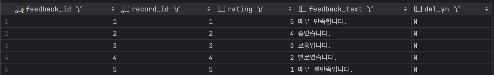
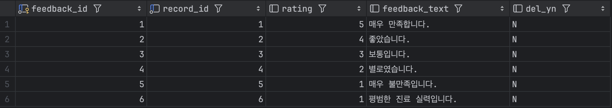
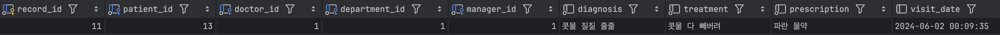
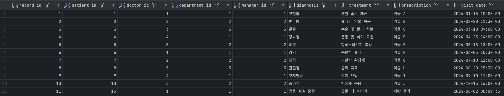

# 📌 FeedBack 프로시저

## 프로시저)AddFeedbackAndUpdateRating: 진료 기록 작성 시 피드백 작성 가능
- 조건: 동일한 진료 id가 있을 시 피드백 작성 불가(이미 피드백을 작성한 진료)오류 출력
    - feedback 테이블에 존재하지 않는 record_id를 입력해야 한다. 만약 존재하는 record_id를 입력한다면? →오류 발생
- 진료 후 환자는 진료받은 의사에 대한 피드백(평점과 리뷰)을 작성할 수 있음
- 환자가 작성한 피드백은 의사 평점에 적용됨

## 1. feedback 테이블에 존재하지 않는 record_id와 평점, 리뷰를 작성한다. (현재 record_id 1~5까지 존재)
- 피드백 입력 전 피드백 테이블

g
- 피드백 입력 후 피드백 테이블


```sql
-- 피드백 입력
call AddFeedbackAndUpdateRating(6, 1, '평범한 진료 실력입니다.');
```

- 피드백 입력 전 의사 평점 테이블


- 피드백 입력 후 의사 평점 테이블


```sql
-- 피드백 입력 전 의사 평점 출력
SELECT FORMAT(avg_rating, 2) AS average_value from Doctors where doctor_id = 1;

-- 피드백 입력 후 의사 평점 출력
SELECT FORMAT(avg_rating, 2) AS average_value from Doctors where doctor_id = 1;
```

---

## 2. feedback 테이블에 존재하는 record_id 사용 -> 오류 발생
- 피드백 테이블


```sql
-- 테스트 4-1. feedback 테이블에 존재하는 record_id 사용 -> 오류 발생
call AddFeedbackAndUpdateRating(6, 1, '평범한 진료 실력입니다.');
```

---

## 3. 환자id와 주민번호 입력시 본인의 진료 기록 조회 (환자)
- 환자 본인의 진료기록만 확인 가능


```sql
    -- 환자id와 주민번호 입력시 진료 기록 조회 (환자)
    SELECT * 
    FROM Medical_Records
    WHERE patient_id = 13;
```

---

## 4. 진료 기록 전체 조회 (관리자)
- 관리자가 모든 환자의 진료기록을 조회

    
```sql
    -- 진료 기록 전체 조회 (관리자)
    SELECT * FROM Medical_Records;
```
