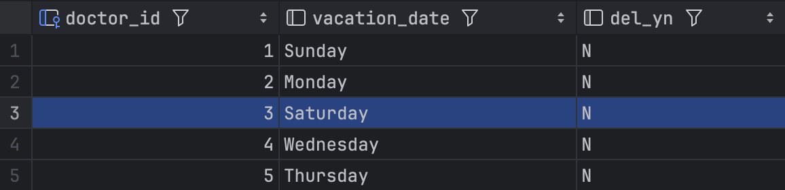
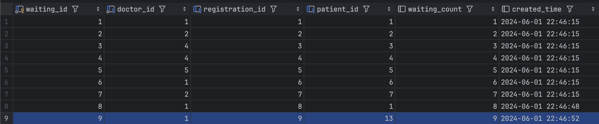
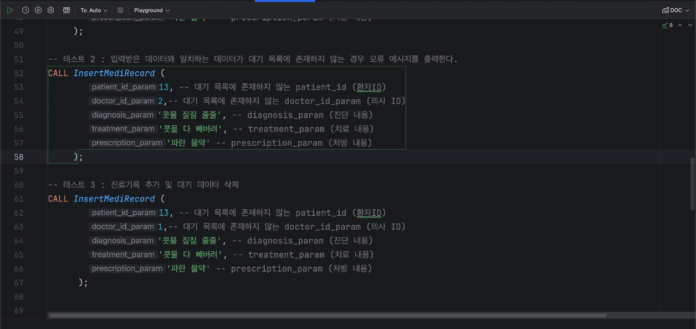
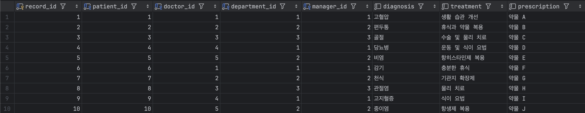
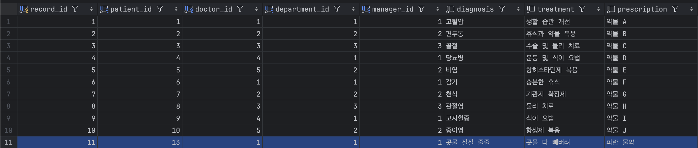
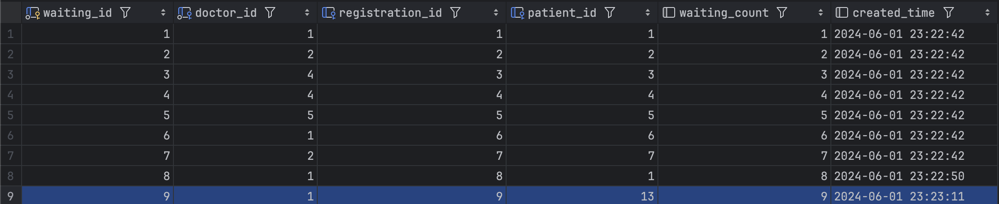
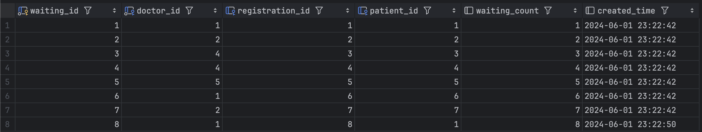

# 📌 MediRecord 프로시저

## 프로시저) InsertMediRecord: 진료 기록 추가 및 대기 테이블에서 삭제
- 진료 후 진료 기록을 작성
    - 환자id, 의사id, 진단 내용, 치료 내용, 처방 내용을 입력
- 조건: 대기 테이블에 일치하는 데이터(환자id, 의사id)가 있어야 함

## 1. 의사의 휴무일이 현재의 요일과 일치하는 경우
오류 메시지’@@@선생님은 오늘 휴무입니다’를 출력
- 의사 휴무 테이블


- 프로시저 실행


```sql
CALL InsertMediRecord ( 13, 3, '콧물 질질 줄줄', '콧물 다 빼버려', '파란 물약' );
```

---

## 2. 입력받은 데이터와 일치하는 데이터가 대기 목록에 존재하지 않는 경우 
대기 테이블에 일치하는 데이터(환자id, 의사id)가 없을시 오류 메세지 ’입력한 정보가 대기 목록에 존재하지 않습니다’ 오류 메시지를 출력
- 대기 테이블
 

- 프로시저 실행
 

```sql
CALL InsertMediRecord ( 13, 2, '콧물 질질 줄줄', '콧물 다 빼버려', '파란 물약' );
```

---

## 3. 진료기록 추가 및 대기 데이터 삭제
진료 후 진료 기록을 작성하면 대기 테이블에 있던 데이터가 삭제
- 추가 전 진료 기록 테이블 
 

- 진료 기록 추가 후 진료 기록 테이블


    
진료 기록 추가 시 대기 테이블에서 사용자의 정보 삭제됨
- 진료 기록 추가 전 대기 테이블

        
- 진료 기록 추가 후 대기 테이블
        

```sql
CALL InsertMediRecord ( 13, 1, '콧물 질질 줄줄', '콧물 다 빼버려', '파란 물약' );
```
