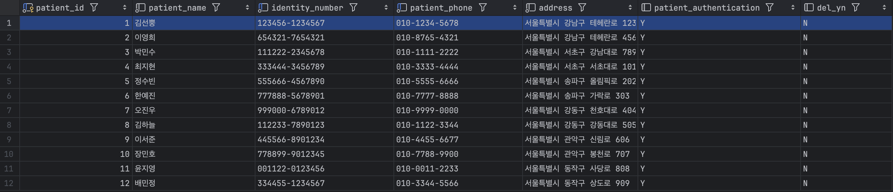
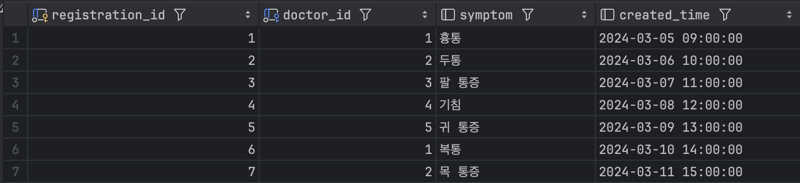
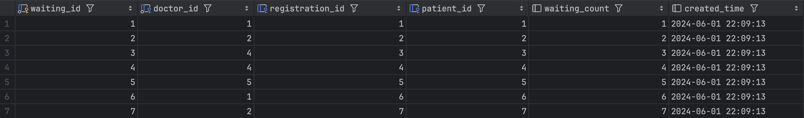
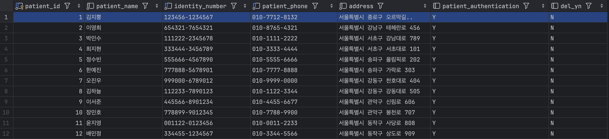
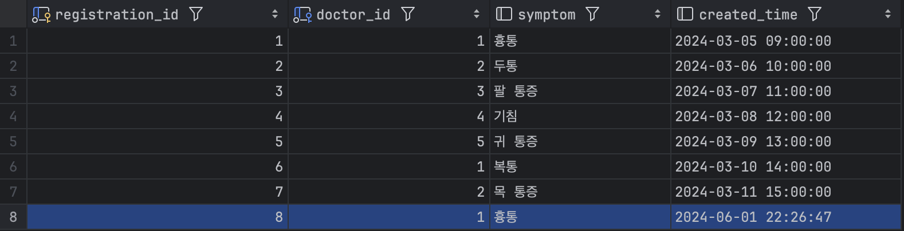
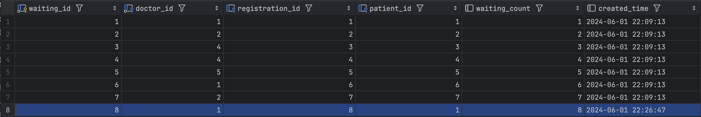
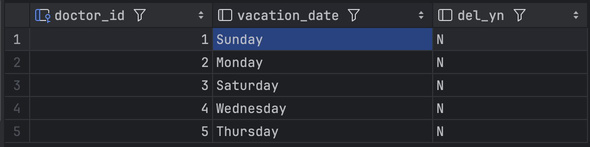
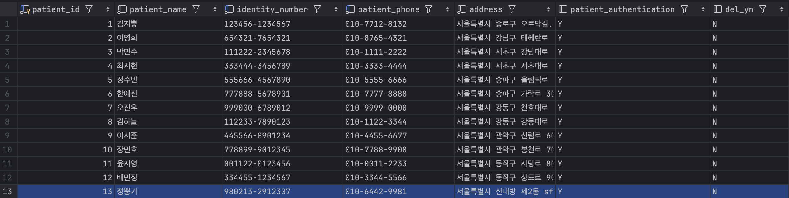
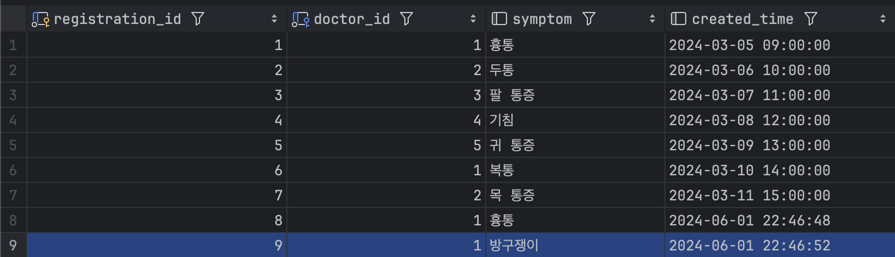

# 📌 Registration 프로시저

## 프로시저 실행 이전
- 환자 테이블

- 접수 테이블

- 대기 테이블

---

## 1. 기존 환자 테이블에 존재하던 환자를 접수
 - 환자 테이블

- 접수 테이블

- 대기 테이블

---

## 2. 의사의 휴무일과 겹치는 날 접수(오류메시지 출력)

- 의사 휴무 테이블

- 프로시저 실행

---

## 3. 환자 테이블에 존재하지 않는 새로운 환자 접수

 - 환자 테이블

- 접수 테이블

- 대기 테이블
