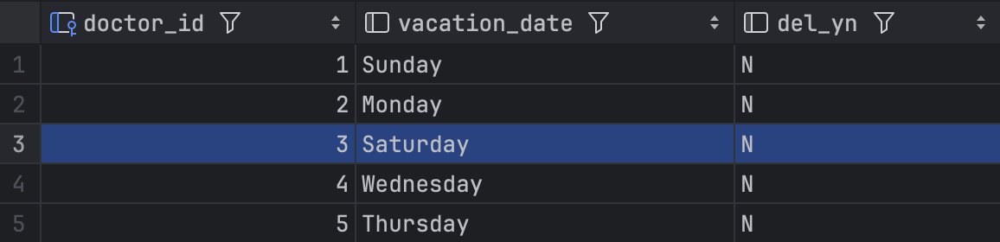

# 📌 Registration 프로시저
## 프로시저) InsertOrUpdateRegistration: 진료 접수 정보를 입력하면 진료 테이블과 대기 테이블에 정보가 생성
- 조건1 : 의사의 휴무일과 접수요일이 달라야 한다. 만약 같다면? -> 오류메시지 출력 (휴무일입니다.)
- 접수테이블에 접수 상태로 추가, 대기 테이블 추가, 환자 테이블 업데이트 또는 추가

## 프로시저 실행 이전
- 환자 테이블


- 접수 테이블


- 대기 테이블


---

## 1. 기존 환자 테이블에 존재하던 환자를 접수 
이미 환자 테이블에 존재하는 환자를 주민번호만 제외하고 나머지 정보는 수정하여 입력한다 -> 주민번호를 제외한 나머지 정보 업데이트(식별자 : 주민번호), 접수와 대기 테이블 추가
 - 환자 테이블


- 접수 테이블


- 대기 테이블


```sql
CALL InsertOrUpdateRegistration(
    1, -- doctor_id_param (의사 ID)
    '흉통', -- symptom_param (증상)
    '김지뿡', -- patient_name_param (환자 이름)
    '123456-1234567', -- identity_number_param (환자 ID)
    '010-7712-8132', -- patient_phone_param (환자 전화번호)
    '서울특별시 종로구 오르막길..' -- address_param (환자 주소)
);
```

---

## 2. 접수 요일이 의사의 휴무일과 일치하는 경우 접수(오류메시지 출력)

- 의사 휴무 테이블


- 프로시저 실행


```sql

CALL InsertOrUpdateRegistration(
    3, -- 휴무인 doctor_id_param (의사 ID)
    '걸으면 허리 뿡', -- symptom_param (증상)
    '김창뿡', -- patient_name_param (환자 이름)
    '000604-3101943', -- identity_number_param (환자 ID)
    '010-8765-1225', -- patient_phone_param (환자 전화번호)
    '서울특별시 구로구 고척스카이돔' -- address_param (환자 주소)
);
```
---

## 3. 환자 테이블에 존재하지 않는 새로운 환자 접수 
환자 테이블에 새로운 데이터 추가, 접수와 대기 테이블 추가
 - 환자 테이블


- 접수 테이블


- 대기 테이블


```sql
CALL InsertOrUpdateRegistration(
    1, -- doctor_id_param (의사 ID)
    '방구쟁이', -- symptom_param (증상)
    '정뿡기', -- patient_name_param (환자 이름)
    '980213-2912307', -- identity_number_param (환자 ID)
    '010-6442-9981', -- patient_phone_param (환자 전화번호)
    '서울특별시 신대방 제2동 sfc빌딩' -- address_param (환자 주소)
);
```